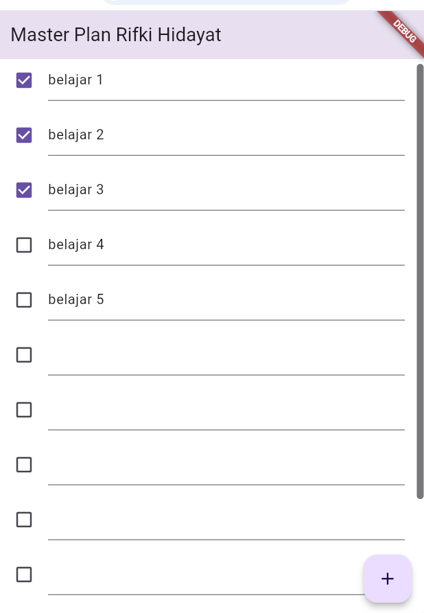
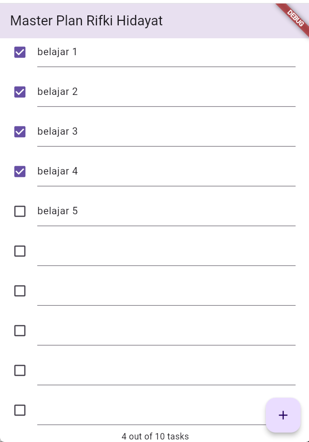
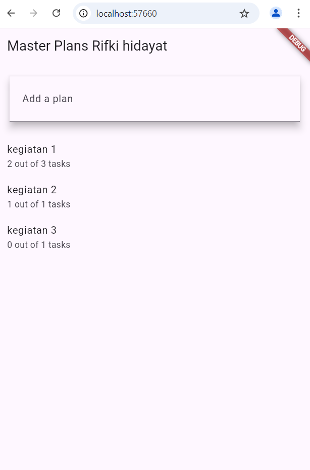
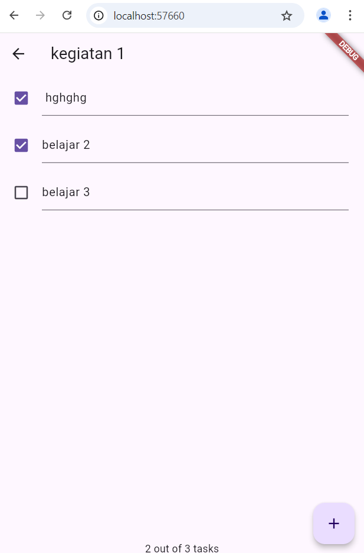

## master_plan

# nama: RIFKI HIDAYAT
# Kelas: 2D TRPL
# nim: 2097

### Penjelasan Laporan Praktikum 1

## Langkah 4: Jelaskan maksud dari langkah 4 pada praktikum tersebut! Mengapa dilakukan 
demikian?
Langkah ini bertujuan untuk mengelompokkan beberapa model data ke dalam satu file
 yang akan mengekspor model-model tersebut. Dengan begitu, proses impor model di file
 lain menjadi lebih ringkas dan terorganisir.

Mengapa dilakukan demikian, Dengan mengelompokkan ekspor model dalam satu file, kita
 dapat mengurangi jumlah baris kode impor di file lain. Ini membuat kode lebih bersih
 dan mudah dikelola seiring berkembangnya aplikasi.

## Langkah 6: Mengapa perlu variabel plan di langkah 6 pada praktikum tersebut? Mengapa dibuat 
konstanta ? 
Variabel plan digunakan untuk menyimpan data rencana yang akan ditampilkan dan 
dimanipulasi di layar. Ini memungkinkan kita untuk mengelola dan memperbarui daftar 
tugas secara dinamis.

Mengapa dibuat konstanta, Plan diinisialisasi sebagai konstanta (const Plan()) untuk
 memastikan bahwa objek Plan awal tidak dapat diubah setelah dibuat. Ini memberikan
 stabilitas awal pada data sebelum ada perubahan yang dilakukan oleh pengguna.

## Langkah 9
Widget _buildTaskTile digunakan untuk menampilkan setiap tugas dalam bentuk ListTile.
 Setiap ListTile memiliki Checkbox untuk menandai tugas selesai atau belum, dan
  TextFormField untuk mengedit deskripsi tugas. Ketika pengguna mengubah status atau
   deskripsi tugas, setState dipanggil untuk memperbarui tampilan dengan data terbaru.

## Langkah 11 dan 13: Apa kegunaan method pada Langkah 11 dan 13 dalam lifecyle state ? 
initState(): Method ini adalah bagian dari lifecycle stateful widget di Flutter yang
 dipanggil sekali ketika state objek pertama kali dibuat. Pada langkah ini, initState
 () digunakan untuk menginisialisasi ScrollController dan menambahkan listener. 
 Listener ini akan memanggil FocusScope.of(context).requestFocus(FocusNode()) setiap 
 kali ada perubahan pada posisi scroll, yang berguna untuk menghilangkan fokus dari
  input field saat pengguna menggulir daftar.

dispose(): Method ini adalah bagian dari lifecycle stateful widget yang dipanggil
 ketika state objek akan dihancurkan dan widget tidak lagi digunakan. Pada langkah
  ini, dispose() digunakan untuk membersihkan ScrollController

### screeshot 1

Pemisahan pada Model-View

### Penjelasan Praktikum 2

## Langkah 1: Jelaskan mana yang dimaksud InheritedWidget pada langkah 1 tersebut! Mengapa 
yang digunakan InheritedNotifier?
InheritedWidget adalah widget khusus di Flutter yang memungkinkan data yang
 didefinisikan di widget tersebut dapat diakses oleh widget turunannya. Ini sering
  digunakan untuk mengelola state yang perlu diakses oleh banyak widget dalam pohon
   widget.

Contoh: PlanProvider adalah subclass dari InheritedNotifier<ValueNotifier<Plan>>,
 yang merupakan jenis InheritedWidget.

kenapa yang digunakan inheritedNotifier?
InheritedNotifier digunakan karena kita ingin memanfaatkan kemampuan ValueNotifier
 untuk memberi tahu widget tentang perubahan data. Dengan InheritedNotifier, kita
  dapat menggabungkan manfaat InheritedWidget dan ValueNotifier, sehingga state dapat
   dikelola dengan efisien dan widget dapat diperbarui secara otomatis ketika data
    berubah.

## Jelaskan maksud dari method di langkah 3 pada praktikum tersebut! Mengapa dilakukan demikian? 
Method completedCount:
Method ini menghitung jumlah tugas yang telah selesai (complete).
Karena, Dengan memiliki method ini, kita dapat dengan mudah mendapatkan jumlah tugas
 yang telah selesai tanpa harus menghitungnya secara manual setiap kali dibutuhkan.

Method completenessMessage:
Method ini menghasilkan pesan yang menunjukkan jumlah tugas yang telah selesai
 dibandingkan dengan total tugas.
Karena, Pesan ini memberikan umpan balik visual kepada pengguna tentang kemajuan
 mereka dalam menyelesaikan tugas. Ini membantu pengguna untuk melihat seberapa banyak
 tugas yang telah mereka selesaikan dan seberapa banyak yang masih perlu dikerjakan.

### sreenshot 2

# langkah 9: jelaskan apa yang dibuat
Menambah State untuk Mengelola Data Layer dengan InheritedWidget dan InheritedNotifier
Widget ini memastikan bahwa completenessMessage ditampilkan dengan aman di bagian
 bawah layar, menghindari area yang mungkin tertutup oleh elemen UI seperti notch
  atau status bar.

### Penjelasan laporan praktikum 3

## 
Gambar diagram tersebut menunjukkan bagaimana struktur aplikasi Flutter dibuat.
Diagram tersebut memperlihatkan dua screens yang berbeda, yaitu PlanCreatorScreen dan
 PlanScreen.

1) PlanCreatorScreen merupakan screen untuk membuat rencana, yang ditunjukkan dengan
 adanya widget PlanProvider dan Column yang memiliki widget anak seperti TextField,
  Expanded, dan ListView.

2) PlanScreen merupakan screen untuk menampilkan rencana yang telah dibuat,
 ditunjukkan dengan adanya widget Scaffold yang memiliki widget anak seperti Column,
  Expanded, SafeArea, ListView, dan Text.

Navigator Push menunjukkan navigasi antar screen. Dalam kasus ini, navigasi dari
 PlanCreatorScreen ke PlanScreen.

Kesimpulan:

Gambar diagram tersebut menggambarkan bagaimana sebuah aplikasi Flutter menggunakan
 state management untuk memanipulasi data antar screens. Data rencana yang dibuat di
  PlanCreatorScreen dapat ditampilkan di PlanScreen melalui navigasi menggunakan
   Navigator Push. Widget-widget yang digunakan di kedua screens menunjukkan bagaimana Flutter dapat digunakan untuk membangun UI yang kompleks dan interaktif.

### screenshot

# Langkah 9: penjelasan
membuat widget _buildMasterPlans() yang akan menampilkan daftar rencana yang ada atau
 pesan jika tidak ada rencana yang tersedia.
ValueNotifier<List<Plan>>: Mengambil daftar rencana dari PlanProvider.
if (plans.isEmpty): Menampilkan pesan jika tidak ada rencana yang tersedia.
ListView.builder: Menampilkan daftar rencana yang ada dengan ListTile untuk setiap
 rencana.
ListTile: Menampilkan nama rencana dan pesan kelengkapan. Ketika ListTile ditekan,
 navigasi ke PlanScreen dengan rencana yang dipilih.
